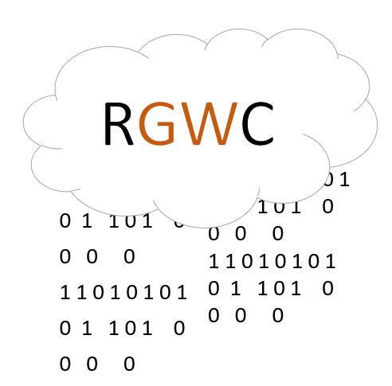

<p align="center">
  
</p>

RadosGW - Connector
=================

Dieses Programm baut eine Verbindung zu einem RadosGW eines Ceph - Clusters
auf. Wenn diese Verbindung steht kann man z.B.: Buckets erstellen,auflisten, . . .  

Inhaltsverzeichnis
=================

  * [RadosGW - Connector](#radosgw-connector)
    * [Erster Schritt](#erster_schritt)
    * [Vorbereitung](#vorbereitung)
    * [Verwendung](#verwendung)
  * [RadosGW - Connector GUI](#radosgw-connector-gui)
  * [RadosGW - Connector Webinterface](#radosgw-connector-webinterface)
  

Erster_Schritt
=================
Zuerst muss man die boto & FileChunkIO libary für python heruntergeladen werden.
(Falls man python3 noch nicht installiert ist bitte nachholen!!!). 

```
pip install boto
pip install FileChunkIO
```
Vorbereitung
=================
Bevor Sie das Programm in verwendung nehmen können müssen Sie
die Userdaten im File UserData.txt eintragen:

<p align="center">
  
</p>

Verwendung
=================
Die Datei radosgwc.py muss mit dem Pythoninterpreter ausgeführt werden: 

```
pyhton radosgwc.py
```
Alle Option erhält man mit 'h' => help
```
RadosGW - Connector

>>> h

 Bucket Functions:
 - l, list your buckets
 - rm, delete a bucket
 - c, create a bucket
 - cd, get into a bucket
 - bn, set a fix bucket name

 Object Functions:
(This Functions can only be used if you are in a bucket!)
 - lo, list objects
 - mo, make an object
 - do, delete an object
 - u, upload to bucket
 - d, download from bucket
 - eb, get out of a bucket
 - pl, make a publiclink
 -rights, set the rights for a object

 Others:
 - h, help
 - space, make some space
 - showd, shows data of the user
 - showl, shows your link logfile
 - downpath, set Downloadpath
 - e, exit
>>>
```
RadosGW-Connector-GUI
=================

Ist eine Grafischebenutzeroberfläche um Buckets & Objekte zu verwalten. Näheres dazu im Wiki.

Sie sieht wie folgt aus:

<p align="center">
  
</p>

RadosGW-Connector-Webinterface
=================

Ist eine Weboberfläche über die man leicht Buckets verwalten kann, diese befindet 
sich derzeit auch nochh in Arbeit